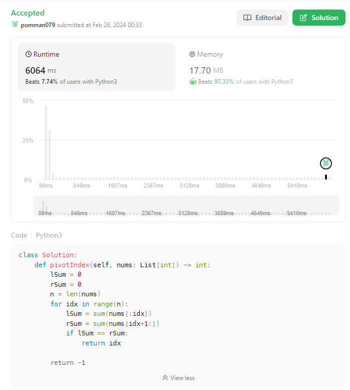

<aside>

> ## 💡 **Situation**

</aside>

전달받은 숫자 배열에 대해 인덱스를 pivot으로 설정하였을 때,

pivot 기준으로 왼쪽에 대해 합산한 결과와 오른쪽으로 합산한 결과를 비교하여 같으면 해당 피봇을 전달하고, 전달할게 없으면 -1 을 반환한다.

<aside>

> ## 📋 **Task**

</aside>

- [x]  for 문 사용하여
    - [x]  피봇 기준 왼쪽을 합산하고
    - [x]  피봇 기준 오른쪽을 합산하여
    - [x]  두 합산을 비교하여 반환한다
- [x]  반환할게 없으면 -1 을 반환한다

<aside>

> ## 🧑‍💻 **Action**

</aside>

```python
class Solution:
    def pivotIndex(self, nums: List[int]) -> int:
        for idx in range(len(nums)):
            lSum = sum(nums[:idx])
            rSum = sum(nums[idx+1:])
            if lSum == rSum:
                return idx

        return -1
```

- 8분 만에 풀었고
- 배열의 from, to 가져오는데 조금 지체하였다

<aside>

> ## 🗽 **Result**

</aside>


속도가 너무 마음에 안 든다.

for문 안에 있는 변수를 빼니 메모리는 좋게 나왔다.



그리고,

잘한 사람은 이상한 퍼포먼스를 보였다.

```python
f = open('user.out', 'w')
inputs = map(loads, stdin)

for nums in inputs:
    n = len(nums)
    total = sum(nums)
    left = 0
    found = False

    for i in range(n):
        if total - left - nums[i] == left:
            found = True
            break
        left += nums[i]

    print(-1 if not found else i, file=f)
```

마음에 드는 코드는 다음과 같다.

```python
class Solution:
    def pivotIndex(self, nums: List[int]) -> int:
        left = 0
        right = sum(nums)
        for i, n in enumerate(nums):
            right -= n
            if left == right:
                return i
            left += n
        return -1
```