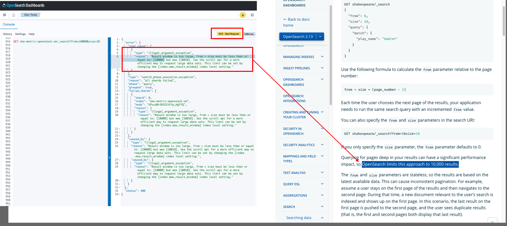
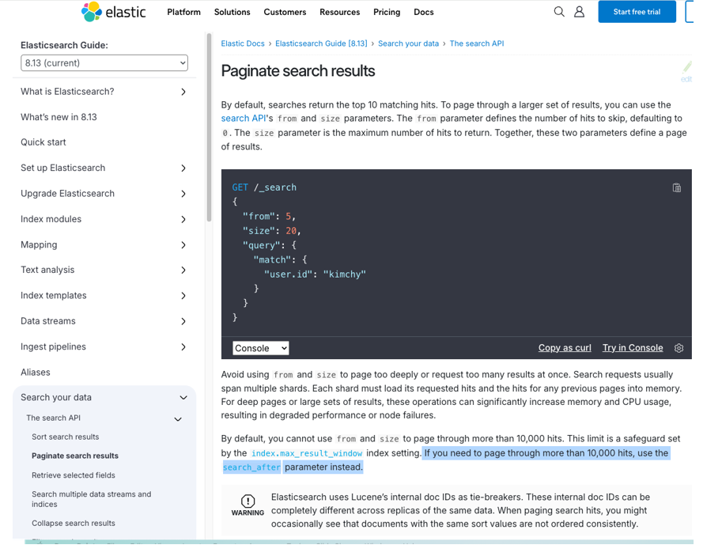

> ## 💡  **Situation** ##
- APM 제품의 application 로그를 시계열 데이터로 적재하고있다.
- 게시판 형태의 페이지에서, 페이지네이션이 가능한 검색이 필요하다.
- 1만건이 넘을 때 페이지를 불러올 수 없다.

 
> ## 📋 **Task** ##
- OpenSearch의 공식 문서를 읽고 제약사항과 대안을 확인한다.
- 부족하면 구글링하여 다른 use case를 파악한다.
- 위 두가지 내용을 gpt 통해 좋은 방법을 확인 후 채택한다.
- 테스트 코드 작성하여, 의도한 대로 되는지 시도해본다.

> ## 👨‍💻 **Action** ##
- OpenSearch 문서 확인  
    

- 지인찬스 → N 사는 6천건으로 설정
- 기본 1만건이지만, 설정으로 바꿀 수 있는 점 확인
    - document 사이즈나 검색 빈도를 고려해서
    - 건수를 늘릴 수록 메모리 사용량이 많아져, 검색에 지장 갈 수 있으니 크게 잡지 않는게 좋은 점 확인
- OpenSearch의 근본인 Elastic Search도 찾아보아도 동일 
    

- 대안은 scroll 과 search_after를 사용하면 가능한점 확인
    - 원리는 마지막 데이터의 고유 아이디와 인덱스 정보를 가지고, 마지막을 찾아가 그 위치(offset)부터 페이지 사이즈만큼 조회하도록 함. 
        

> ## 🗽 **Result** ##
- scroll 사용해서 페이지네이션 하도록 변경
- 프론트개발 리드 분께서 이해 못하셔서 설명해드렸지만, 20년동안 처음 본다고 하셔서 아래 내용들을 가지고 납득시켜드린 좋은 경험도 함.
  - RDB와 차이점
  - OpenSearch/elastic 공식 문서
  - dev tool 과 play ground에서 테스트결과 첨부
  - scoll 과 search_after이라는 대안